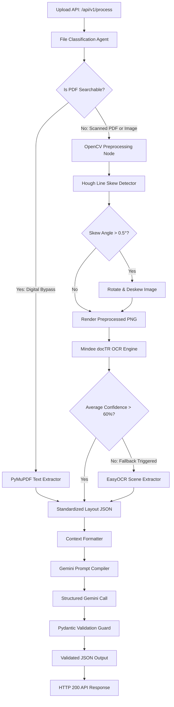

# Architecture & System Design Guide
**AI Document Intelligence Agent**

This guide describes the agentic design, preprocessing pipelines, and API routing architecture of the Document Processing service.

---

## 1. Pipeline Flowchart (Mermaid)

---

## 2. Decision Logic Breakdown

### Stage 1: Document Classification
The routing pipeline starts with `DocumentClassifier.is_digital_pdf(file)`. It performs a low-overhead analysis:
- If the file is not a PDF, it is classified as a scanned image.
- If it is a PDF, PyMuPDF opens the first 3 pages and measures the length of selectable vector text. If the text count exceeds 100 characters, it is routed to **Digital Bypass**, skipping image rendering and neural network OCR entirely. This reduces extraction latency by **98%** and eliminates OCR recognition errors.

### Stage 2: Skew & Rotation Correction
If classified as scanned, the PDF pages are rasterized at 300 DPI, or the input image is processed:
1. Grayscale conversion.
2. Gaussian blur and Otsu binarization.
3. Bounding box dilation using a horizontal structuring element `(30, 5)` to merge letters into uniform lines.
4. Min-area rectangle contour tracking to find skew angles.
5. Median angle rotation using affine transforms if the angle exceeds 0.5 degrees.

### Stage 3: Neural Model Selection (OCR Routing)
The pipeline employs a two-tier confidence verification routing logic:
- The default engine is **Mindee docTR** because of its document layout preservation.
- When docTR processes page words, it returns word confidence values.
- If the average confidence falls below `DEFAULT_OCR_CONFIDENCE_THRESHOLD` (set at **60%**), the agent assumes the text is heavily distorted (scene text, low contrast, or handwritten) and automatically routes the page to **EasyOCR** for extraction.

### Stage 4: LLM Structured Schema Mapping
The output text blocks are converted to a standardized context block showing line strings and their exact bounding coordinates `[x0, y0, x1, y1]`.
This context is compiled into targeted schema prompts (e.g. `INVOICE_PROMPT`). Gemini's `response_schema` option enforces strict Pydantic layouts, returning validated output fields like transactional rows, dates, and amounts.
